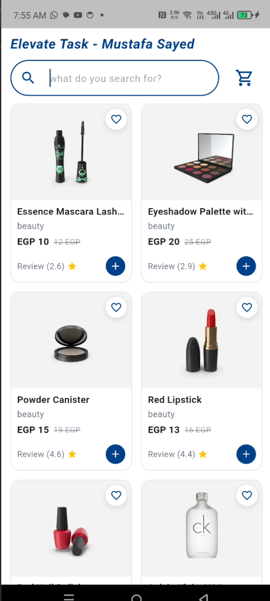
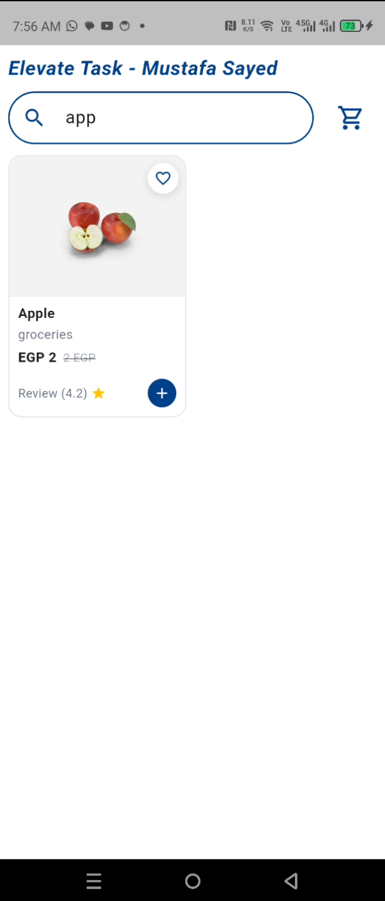
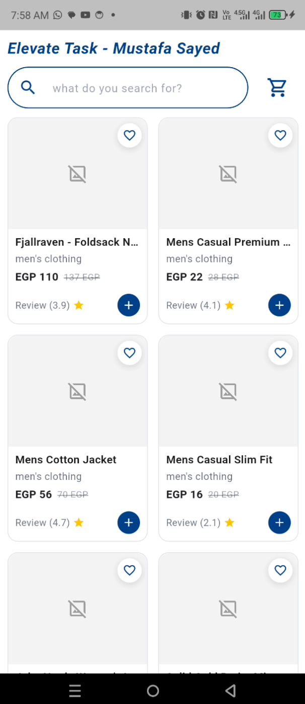

# Elevate Flutter Task — Route Products

Product listing screen (2-column grid) built with Flutter, backed by
`https://fakestoreapi.com/products`, matching the provided Route design.

## Screenshots

Real device screenshots from this run:

| App — product grid | App — search filter (`app` → Apple) | App — offline bundle fallback |
| --- | --- | --- |
|  |  |  |

Design reference from the task `.docx`: `docs/task-design-reference.png`.

Note: `app-grid` shows the dummyjson fallback (beauty category) with
network images loading; `app-offline` shows the local
`assets/products_fallback.json` bundle serving data when images have no
network (placeholder icon is expected offline).

## Features

- Products grid (`GridView`, 2 columns) with image, title, category, price +
  crossed-out old price, rating + star, favorite toggle, add-to-cart button
- `Route` header + rounded search bar with live local filtering by title/category
- Loading / error + retry / empty-search states, pull-to-refresh
- Cached network images

## Architecture (bonus points)

Clean MVVM-style layering with Cubit:

```text
lib/
  main.dart
  core/
    api/api_client.dart          # Dio client (baseUrl: fakestoreapi.com)
    di/injection.dart            # get_it service locator (injectable pattern)
  features/products/
    domain/entities/product.dart
    domain/repositories/product_repository.dart
    domain/usecases/get_products.dart
    data/models/product_model.dart
    data/datasources/product_remote_data_source.dart
    data/repositories/product_repository_impl.dart
    presentation/cubit/products_cubit.dart + products_state.dart
    presentation/pages/products_page.dart
    presentation/widgets/product_card.dart + home_header.dart
```

- State: `flutter_bloc` Cubit (`ProductsCubit`, `ProductsState`)
- Repository pattern: `ProductRepository` + `ProductRepositoryImpl`
- DI: `get_it` + `injectable` annotations (`@injectable`, `@LazySingleton`),
  wired manually in `core/di/injection.dart` (no build_runner needed)
- Network: `dio`; images: `cached_network_image`

## Getting started

```bash
flutter pub get
flutter analyze
flutter test
flutter run
```

## API

- Primary (required by task): `GET https://fakestoreapi.com/products`
- Resilient chain in `ProductRemoteDataSourceImpl.fetchProducts()`:
  1. fakestoreapi → 2. `GET https://dummyjson.com/products?limit=30`
     (via `ProductModel.fromDummyJson` adapter) → 3. offline
     `assets/products_fallback.json` (20 items, always loads)
- Sample item: `id, title, price, description, category, image, rating{rate,count}`
- Old price shown in UI is derived (`price * 1.25`) since the API has no
  discount field — this matches the crossed-out price in the design.

## Tests

- `ProductModel` JSON parsing
- `ProductsState.filtered` search logic
- `HomeHeader` search-bar widget smoke test

